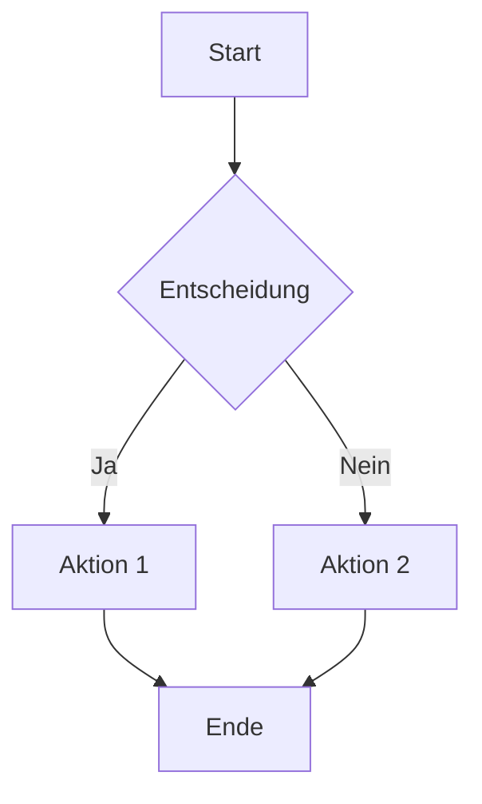
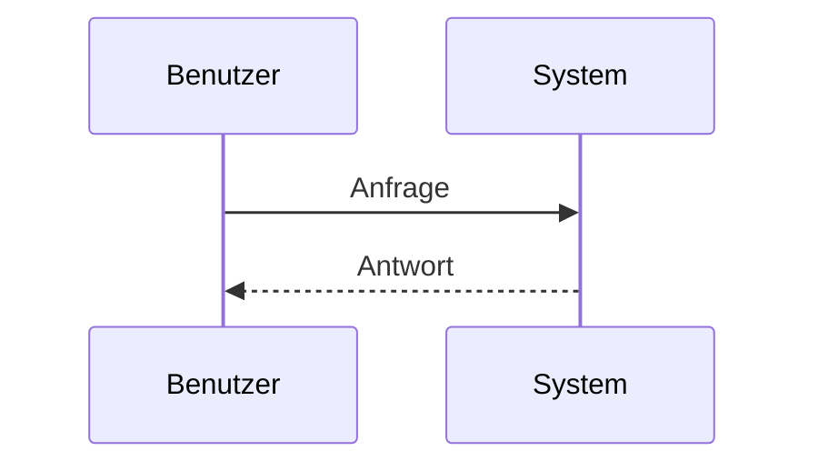
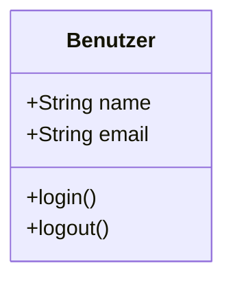
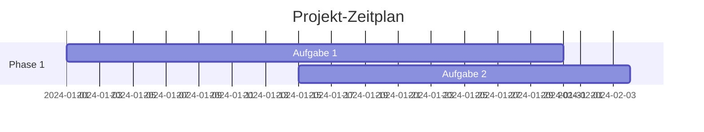

# Mermaid-Diagramme erstellen

Generiere Mermaid-Diagramm: $ARGUMENTS

## Diagramm-Typen

### Flussdiagramm

### Sequenzdiagramm

### Klassendiagramm

### Gantt-Diagramm

## Verwendung

1. **Diagramm-Typ identifizieren**
2. **Mermaid-Syntax erstellen**
3. **Diagramm in Mermaid-Viewer testen**
4. **In Dokumentation einbetten**

## Best Practices

- Klare, aussagekräftige Labels verwenden
- Konsistente Farbschemata anwenden
- Diagramme nicht zu komplex gestalten
- Legende hinzufügen bei Bedarf
