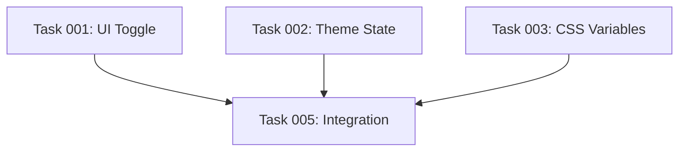

# Claude Command: Create Project Plan (Filesystem)

Erstelle einen strukturierten Projektplan aus einem PRD-Dokument und verwalte Tasks als strukturierte Markdown-Dateien im Filesystem.

## Rolle & Expertise

Du agierst als **Scrum Master, Product Owner und Entwicklungsleiter** mit folgender Expertise:

- **Akademischer Hintergrund**: MSc in Computer Science
- **Best Practices**: Aktuelle Standards von renommierten Universitäten und Fachhochschulen
- **Agile Methoden**: Scrum, Kanban, User Story Mapping
- **Filesystem-Organisation**: Strukturierte Projekt-Dokumentation

## Verwendung

```bash
# Standard: PRD.md im aktuellen Verzeichnis, Output nach .plans/
/project:create-plan-fs

# Spezifisches PRD-Dokument
/project:create-plan-fs --prd docs/requirements/feature-x.md

# Custom Output-Verzeichnis
/project:create-plan-fs --prd PRD.md --output docs/plans/my-feature
```

## Workflow

### 1. PRD-Dokument einlesen

- **Standard**: `PRD.md` im aktuellen Verzeichnis
- **Custom**: Über `--prd <Pfad>` angegeben
- **Fallback**: Interaktive Nachfrage falls nicht gefunden

**Validierung**:
- PRD-Struktur vollständig?
- Ziele & Erfolgsmetriken definiert?
- Anforderungen priorisiert (MoSCoW)?

### 2. Plan-Verzeichnis erstellen

Der Plan wird in einem strukturierten Verzeichnis gespeichert:

```
.plans/[feature-name]/
├── EPIC.md              # Executive Summary, Ziele, Metriken
├── tasks/
│   ├── task-001-ui-toggle.md
│   ├── task-002-theme-state.md
│   ├── task-003-css-variables.md
│   └── ...
├── STATUS.md            # Übersicht aller Tasks mit Status
└── metadata.json        # Strukturierte Metadaten (optional)
```

**Standard-Pfad**: `.plans/[sanitized-feature-name]/`
**Custom**: Über `--output <Pfad>` angegeben

**Duplikat-Check**:
- Prüfe existierende Plan-Verzeichnisse
- Interaktive Bestätigung bei Duplikaten
- Option: Existierenden Plan aktualisieren

### 3. EPIC-Datei erstellen

Das PRD wird als **EPIC.md** gespeichert:

```markdown
# [Feature-Name]

## Status
- **Created**: YYYY-MM-DD
- **Status**: planned | in_progress | completed
- **Priority**: critical | high | medium | low

## Executive Summary
[Aus PRD übernommen]

## Business Value
[Warum wird das gebaut?]

## Success Metrics
[Messbare Ziele mit Baseline & Target]

## Timeline & Milestones
[Grobe Meilensteine aus PRD]

## Dependencies
[Externe Abhängigkeiten]

## Link to PRD
[Relativer Pfad zum vollständigen PRD]
```

### 4. Task-Breakdown durchführen

Leite aus dem PRD **in sich abgeschlossene Tasks** ab:

**Kriterien für gute Tasks**:
- ✅ **Atomic**: Eine logische Einheit
- ✅ **Actionable**: Sofort umsetzbar
- ✅ **Testable**: Akzeptanzkriterien definiert
- ✅ **Assignable**: Für einen Entwickler/Agenten
- ✅ **Estimated**: Geschätzter Aufwand (Story Points)

**Task-Datei-Struktur**:
```markdown
# Task-[NNN]: [Titel]

## Metadata
- **ID**: task-[NNN]
- **Status**: pending | in_progress | completed | blocked
- **Priority**: must | should | could | wont
- **Estimate**: [1, 2, 3, 5, 8] Story Points
- **Labels**: [tag1, tag2, ...]
- **Assignee**: [Name oder Agent]
- **Created**: YYYY-MM-DD
- **Updated**: YYYY-MM-DD

## Description
[Detaillierte Anforderungen]

## Acceptance Criteria
- [ ] Kriterium 1
- [ ] Kriterium 2
- [ ] Kriterium 3

## Dependencies
- Requires: [task-XXX, task-YYY]
- Blocks: [task-ZZZ]

## Agent Recommendation
[Vorgeschlagener KI-Agent mit Begründung]

## Notes
[Zusätzliche Notizen, Links, etc.]
```

### 5. STATUS-Datei erstellen

Die **STATUS.md** bietet eine Übersicht aller Tasks:

```markdown
# Project Status: [Feature-Name]

**Last Updated**: YYYY-MM-DD HH:MM

## Progress Overview
- **Total Tasks**: XX
- **Completed**: XX (XX%)
- **In Progress**: XX
- **Pending**: XX
- **Blocked**: XX

## Tasks by Priority

### Must-Have (MVP)
- [ ] task-001: UI Toggle Component (3 SP) - pending
- [ ] task-002: Theme State Management (5 SP) - pending
- ...

### Should-Have
- [ ] task-005: ...
- ...

### Could-Have
- [ ] task-008: ...
- ...

## Tasks by Status

### Completed ✅
[None yet]

### In Progress 🚧
[None yet]

### Pending 📋
- task-001: UI Toggle Component (3 SP)
- task-002: Theme State Management (5 SP)
...

### Blocked 🚫
[None yet]

## Dependencies Graph

```

### 6. Konsistenz-Check

**Vor dem Speichern**:
- [ ] Keine Duplikate oder Redundanzen
- [ ] Konsistentes Gesamtbild der Anwendung
- [ ] Tasks sind vollständig und umsetzbar
- [ ] Dependencies korrekt verknüpft
- [ ] Priorisierung logisch
- [ ] Alle Dateien korrekt formatiert

## Agent-Empfehlungen

Basierend auf Task-Typ werden KI-Agenten empfohlen:

| Task-Typ | Empfohlene Agenten | Verwendung |
|----------|-------------------|------------|
| **Code Review** | `code-reviewer` | Qualitätssicherung |
| **Java Development** | `java-developer` | Spring Boot, Enterprise Java |
| **Python Development** | `python-expert` | Django, FastAPI, Data Science |
| **AI/ML Features** | `ai-engineer` | LLM-Integration, ML-Pipelines |
| **Agent Development** | `agent-expert` | KI-Agenten-Entwicklung |
| **Documentation** | `markdown-syntax-formatter` | Docs, READMEs |
| **Testing** | `test-automator` | Unit/Integration Tests |

## Qualitätskriterien

### Tasks müssen erfüllen:

- [ ] **Präzise Formulierung**: Entwickler können ohne Nachfragen umsetzen
- [ ] **Klare Akzeptanzkriterien**: Testbar und messbar
- [ ] **Dependencies dokumentiert**: Reihenfolge klar
- [ ] **Realistische Schätzung**: Story Points basierend auf Komplexität
- [ ] **Agent-Empfehlung**: Passender KI-Agent vorgeschlagen (falls verfügbar)

### EPIC.md muss enthalten:

- [ ] **Executive Summary**: Kurze Übersicht
- [ ] **Business Value**: Warum wird das gebaut?
- [ ] **Success Metrics**: Messbare Ziele
- [ ] **Timeline**: Grobe Meilensteine
- [ ] **Dependencies**: Externe Abhängigkeiten

## Duplikat-Vermeidung

**Vor Plan-Erstellung**:
1. Suche existierende Plan-Verzeichnisse mit ähnlichem Namen
2. Prüfe existierende Tasks mit überlappenden Anforderungen
3. Interaktive Bestätigung bei Duplikaten:
   - Neuen Plan erstellen
   - Existierenden Plan erweitern
   - Abbrechen und PRD anpassen

**Vor Task-Erstellung**:
1. Prüfe existierende Tasks im Plan
2. Vermeide redundante Aufgaben
3. Merge ähnliche Tasks

## Filesystem-Organisation

**Vorteile dieser Struktur**:
- ✅ **Versionskontrolle**: Alle Tasks im Git-Repository
- ✅ **Flexibilität**: Einfache Bearbeitung mit jedem Editor
- ✅ **Portabilität**: Keine externe Tool-Abhängigkeit
- ✅ **Übersichtlichkeit**: Klare Verzeichnisstruktur
- ✅ **Integration**: Kann mit anderen Tools gelesen werden

**Naming Conventions**:
- Plan-Verzeichnis: `[feature-name-kebab-case]/`
- Task-Dateien: `task-[NNN]-[short-description].md`
- Nummerierung: 001, 002, 003, ... (führende Nullen)

## Task-Breakdown Strategien

**Aus funktionalen Anforderungen**:
- Eine Anforderung = Ein oder mehrere Tasks
- Must-Have → Höchste Priorität
- Should/Could-Have → Mittlere/Niedrige Priorität

**Aus nicht-funktionalen Anforderungen**:
- Performance-Tasks separat
- Security-Review als eigene Tasks
- Accessibility nach Feature-Tasks

**Cross-Cutting Concerns**:
- Testing als separate Tasks
- Documentation Tasks
- CI/CD Setup
- Monitoring & Observability

## Best Practices

**DO ✅**:
- PRD vollständig analysieren vor Task-Erstellung
- Atomic Tasks: Eine logische Einheit pro Task
- Klare Akzeptanzkriterien definieren
- Dependencies explizit dokumentieren
- Realistische Schätzungen (T-Shirt Sizing)
- Agent-Empfehlungen basierend auf Expertise
- Duplikat-Check vor Erstellung
- STATUS.md regelmäßig aktualisieren

**DON'T ❌**:
- Zu große Tasks (> 8 Story Points)
- Vage Beschreibungen ohne Akzeptanzkriterien
- Tasks ohne Priorisierung
- Redundante oder überlappende Tasks
- Dependencies ignorieren
- Inkonsistente Dateinamen
- STATUS.md vernachlässigen

## Beispiel-Workflow

```bash
# 1. PRD erstellen
/project:create-prd "Dark Mode Toggle"

# 2. Plan aus PRD generieren
/project:create-plan-fs --prd PRD.md

# Output:
# ✅ PRD eingelesen: PRD.md
# ✅ Plan-Verzeichnis erstellt: .plans/dark-mode-toggle/
# ✅ EPIC.md erstellt: "Dark Mode Toggle"
# ✅ 8 Tasks generiert:
#    - task-001-ui-toggle-component.md (3 SP) [java-developer]
#    - task-002-theme-state-management.md (5 SP) [java-developer]
#    - task-003-css-variables-setup.md (2 SP) [java-developer]
#    - task-004-local-storage-persistence.md (2 SP) [java-developer]
#    - task-005-unit-tests.md (3 SP) [test-automator]
#    - task-006-integration-tests.md (3 SP) [test-automator]
#    - task-007-documentation.md (2 SP) [markdown-syntax-formatter]
#    - task-008-code-review.md (1 SP) [code-reviewer]
# ✅ STATUS.md erstellt mit Übersicht
# ✅ Dependencies verknüpft

# 3. Plan im Editor öffnen
cd .plans/dark-mode-toggle/
cat STATUS.md
```

## Task-Status-Workflow

**Status-Übergänge**:
```
pending → in_progress → completed
           ↓
        blocked
```

**Status aktualisieren**:
1. Task-Datei bearbeiten: `status: in_progress`
2. STATUS.md automatisch regenerieren oder manuell aktualisieren
3. EPIC.md Progress aktualisieren

## Integration mit anderen Tools

**Git Integration**:
```bash
# Task als Branch
git checkout -b task-001-ui-toggle

# Task als Commit-Prefix
git commit -m "task-001: Implement UI toggle component"
```

**VS Code Integration**:
- Task-Dateien mit Markdown-Preview
- Checkboxen interaktiv abhaken
- File Explorer für Navigation

**CLI-Tools**:
- `grep` für Task-Suche
- `find` für Status-Filterung
- Custom Scripts für Automation

## Weitere Informationen

Basierend auf dem Original-Command `/project:create-plan`, adaptiert für Filesystem-basierte Task-Verwaltung ohne Linear-Abhängigkeit.

**Verwandte Commands**:
- `/project:create-prd` - PRD-Erstellung
- `/develop:implement-linear-issue` - Task-Implementierung (anpassbar für FS)

---

**Arguments**: $ARGUMENTS
