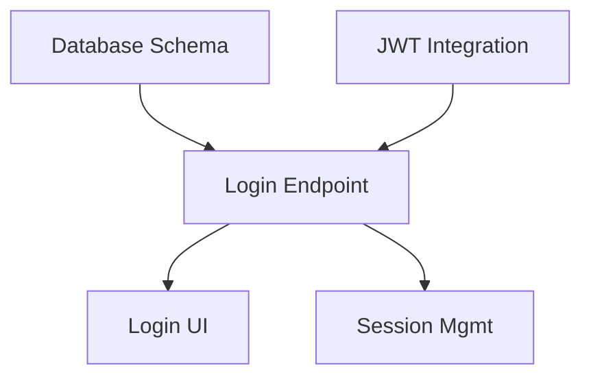

# Best Practices: Filesystem-basierte Projektplanung

## Grundprinzipien

### 1. Konsistente Namenskonventionen

**Verzeichnisse**:
```
✅ .plans/dark-mode-toggle/
✅ .plans/user-authentication/
✅ .plans/api-rate-limiting/

❌ .plans/DarkMode/
❌ .plans/User_Auth/
❌ .plans/API-RateLimiting/
```

**Regel**: Lowercase, kebab-case, beschreibend

**Task-Dateien**:
```
✅ task-001-ui-toggle-component.md
✅ task-042-integration-test-suite.md

❌ task-1-ui.md
❌ Task_042_Integration_Tests.md
```

**Regel**: `task-NNN-short-description.md` (führende Nullen!)

### 2. Atomic Tasks

**Ein Task sollte**:
- Eine logische Einheit darstellen
- In 1-3 Tagen umsetzbar sein
- Klare Akzeptanzkriterien haben
- Unabhängig testbar sein

**Gutes Beispiel**:
```markdown
# Task-005: Implement Login API Endpoint

## Description
Create REST endpoint for user login with email and password.

## Acceptance Criteria
- [ ] POST /api/auth/login endpoint created
- [ ] Email validation implemented
- [ ] Password hashing verified
- [ ] JWT token generated on success
- [ ] Error handling for invalid credentials
```

**Schlechtes Beispiel**:
```markdown
# Task-005: Implement Authentication

## Description
Build the entire authentication system.

## Acceptance Criteria
- [ ] Everything works
```

### 3. Klare Dependencies

**Explizit dokumentieren**:
```markdown
## Dependencies

- **Requires**:
  - task-001 (Database schema must be created first)
  - task-003 (JWT library must be integrated)

- **Blocks**:
  - task-008 (Login UI depends on this endpoint)
  - task-009 (Session management needs auth)
```

**Visualisieren in STATUS.md**:


### 4. Messbare Akzeptanzkriterien

**Gut ✅**:
```markdown
- [ ] API responds within 200ms (p95)
- [ ] Unit test coverage > 90%
- [ ] All edge cases handled (empty input, special chars, SQL injection)
- [ ] Error messages follow API spec v2.1
```

**Schlecht ❌**:
```markdown
- [ ] Fast performance
- [ ] Good test coverage
- [ ] Handles errors
- [ ] Works correctly
```

### 5. Realistische Story Points

**Fibonacci-Skala**: 1, 2, 3, 5, 8, 13

| Points | Komplexität | Typische Aufgaben |
|--------|-------------|-------------------|
| **1** | Trivial | CSS-Änderung, Typo-Fix, Doku-Update |
| **2** | Einfach | Einfache Komponente, Config-Update |
| **3** | Mittel | Standard-Feature, einfaches API-Endpoint |
| **5** | Komplex | Komplexe Logik, mehrere Dateien, Integration |
| **8** | Sehr komplex | Architektur-Änderung, neue Abhängigkeit |
| **13+** | Zu groß! | **Split in kleinere Tasks!** |

### 6. STATUS.md regelmäßig aktualisieren

**Best Practice**:
- Nach jedem abgeschlossenen Task aktualisieren
- Täglich Progress-Check
- Vor Meetings aktualisieren

**Automatisierung (optional)**:
```bash
# Script zum Generieren von STATUS.md aus Task-Dateien
#!/bin/bash
./scripts/generate-status.sh .plans/dark-mode-toggle/
```

### 7. Agent-Empfehlungen nutzen

**Matching Task → Agent**:

```markdown
## Task: Implement REST API
**Recommended Agent**: `java-developer`
**Rationale**: Spring Boot backend, JPA integration

## Task: Create React Component
**Recommended Agent**: `frontend-developer`
**Rationale**: Complex state management, accessibility

## Task: Write Unit Tests
**Recommended Agent**: `test-automator`
**Rationale**: Test coverage, mocking, assertions

## Task: Review Code Quality
**Recommended Agent**: `code-reviewer`
**Rationale**: Best practices, security, performance
```

### 8. Priorisierung strikt einhalten

**MoSCoW-Methode**:

```markdown
## Must-Have (MVP)
Ohne diese Features ist das Produkt nicht nutzbar.
→ Status: Muss in dieser Phase fertig werden

## Should-Have
Wichtig, aber nicht kritisch für MVP.
→ Status: Wenn Zeit bleibt oder nächste Phase

## Could-Have
Nice-to-have, aber nicht prioritär.
→ Status: Backlog für spätere Phasen

## Won't-Have
Explizit ausgeschlossen für diese Phase.
→ Status: Dokumentiert, damit keine Erwartungen entstehen
```

## Workflow-Best-Practices

### Plan-Erstellung

```bash
# 1. PRD existiert und ist vollständig
cat PRD.md

# 2. Plan erstellen
/project:create-plan-fs --prd PRD.md

# 3. Review der generierten Tasks
cd .plans/[feature-name]/
cat STATUS.md

# 4. Ggf. Tasks manuell anpassen
vim tasks/task-003-api-endpoint.md

# 5. STATUS.md regenerieren
# (manuell oder via Script)

# 6. In Git committen
git add .plans/
git commit -m "docs: add project plan for [feature-name]"
```

### Task-Bearbeitung

```bash
# 1. Task öffnen und Status auf "in_progress" setzen
cd .plans/[feature-name]/tasks/
vim task-005-login-endpoint.md

# 2. Branch erstellen (optional)
git checkout -b task-005-login-endpoint

# 3. Implementierung durchführen
# ... code, code, code ...

# 4. Akzeptanzkriterien abhaken
vim task-005-login-endpoint.md
# [x] POST /api/auth/login endpoint created
# [x] Email validation implemented
# ...

# 5. Status auf "completed" setzen
# status: completed
# updated: 2025-01-17

# 6. STATUS.md aktualisieren
cd ..
# Manuell oder via Script

# 7. Commit
git add .
git commit -m "feat: implement login API endpoint (task-005)"
```

### Status-Tracking

**Empfohlene Routine**:

**Daily**:
- [ ] Aktuellen Task-Status prüfen
- [ ] Blockierte Tasks identifizieren
- [ ] STATUS.md aktualisieren

**Weekly**:
- [ ] Gesamtfortschritt reviewen
- [ ] Dependencies prüfen
- [ ] Nächste Woche planen

**Bei Milestone**:
- [ ] Alle completed Tasks verifizieren
- [ ] EPIC.md Progress aktualisieren
- [ ] Retrospektive durchführen

## Git-Integration

### Commit-Messages

**Pattern**: `<type>: <description> (task-NNN)`

```bash
✅ feat: implement dark mode toggle (task-001)
✅ fix: resolve CSS variable inheritance (task-003)
✅ test: add unit tests for theme context (task-005)
✅ docs: update README with dark mode usage (task-007)

❌ updated stuff
❌ task 001
❌ WIP
```

### Branch-Strategie

**Option 1: Task-Branches**:
```bash
git checkout -b task-001-ui-toggle
# ... implement ...
git commit -m "feat: implement UI toggle component (task-001)"
git push origin task-001-ui-toggle
# Create PR referencing task file
```

**Option 2: Feature-Branch**:
```bash
git checkout -b feature/dark-mode-toggle
# Implement all tasks on one branch
git commit -m "feat: implement UI toggle (task-001)"
git commit -m "feat: add theme state management (task-002)"
# ... etc
```

### PR-Beschreibung

```markdown
## Related Tasks

Closes: task-001, task-002, task-003

## Implementation

Implemented dark mode toggle feature as defined in `.plans/dark-mode-toggle/`.

**Completed Tasks**:
- ✅ task-001: UI Toggle Component (3 SP)
- ✅ task-002: Theme State Management (5 SP)
- ✅ task-003: CSS Variables Setup (2 SP)

**Pending**:
- ⏸️ task-004: Local Storage (blocked on backend config)

## Testing

All acceptance criteria from task files verified.

## Screenshots

[Screenshots showing light/dark mode]
```

## Anti-Patterns vermeiden

### ❌ Task-Inflation

**Problem**:
```
task-001-add-button.md
task-002-style-button.md
task-003-test-button.md
task-004-document-button.md
```

**Besser**:
```
task-001-implement-button.md
  - Acceptance Criteria:
    - [ ] Button component created
    - [ ] Styles applied
    - [ ] Unit tests written
    - [ ] Documentation added
```

### ❌ Vage Beschreibungen

**Problem**:
```markdown
# Task-007: Fix bugs
## Description
Fix all the bugs in the feature.
```

**Besser**:
```markdown
# Task-007: Fix Login Validation Edge Cases
## Description
Fix three specific validation bugs identified in QA:
1. Email validation accepts invalid domains
2. Password field allows empty input
3. Error messages not displaying

## Acceptance Criteria
- [ ] Email regex updated to RFC 5322
- [ ] Password min-length enforced (8 chars)
- [ ] Error component renders correctly
```

### ❌ Orphan Tasks

**Problem**: Tasks ohne Kontext oder Verbindung zum EPIC.

**Lösung**: Jeder Task muss zum EPIC passen und dessen Ziele unterstützen.

### ❌ Inconsistente Updates

**Problem**: STATUS.md ist veraltet, Tasks sind aktualisiert, aber nicht synchronisiert.

**Lösung**:
- Automatisierung mit Script
- Oder: Strikte Routine (Task-Update → sofort STATUS.md aktualisieren)

### ❌ Dependency-Hell

**Problem**:
```
task-001 requires task-005
task-005 requires task-003
task-003 requires task-001  # Circular!
```

**Lösung**: Dependencies sorgfältig planen, Zyklen vermeiden.

## Tools & Scripts

### Status-Generator (Beispiel)

```python
#!/usr/bin/env python3
"""Generate STATUS.md from task files."""

import os
import re
from datetime import datetime
from pathlib import Path

def parse_task_file(filepath):
    """Extract metadata from task file."""
    with open(filepath) as f:
        content = f.read()

    # Parse metadata
    status = re.search(r'Status:\s*(\w+)', content)
    priority = re.search(r'Priority:\s*(\w+)', content)
    estimate = re.search(r'Estimate:\s*(\d+)', content)
    title = re.search(r'^#\s*Task-\d+:\s*(.+)$', content, re.MULTILINE)

    return {
        'title': title.group(1) if title else 'Unknown',
        'status': status.group(1) if status else 'unknown',
        'priority': priority.group(1) if priority else 'unknown',
        'estimate': int(estimate.group(1)) if estimate else 0,
        'file': filepath.name
    }

def generate_status(plan_dir):
    """Generate STATUS.md for a plan directory."""
    tasks_dir = Path(plan_dir) / 'tasks'
    task_files = sorted(tasks_dir.glob('task-*.md'))

    tasks = [parse_task_file(f) for f in task_files]

    # Calculate statistics
    total = len(tasks)
    completed = sum(1 for t in tasks if t['status'] == 'completed')
    in_progress = sum(1 for t in tasks if t['status'] == 'in_progress')
    pending = sum(1 for t in tasks if t['status'] == 'pending')
    blocked = sum(1 for t in tasks if t['status'] == 'blocked')

    # Generate STATUS.md content
    status_content = f"""# Project Status: {Path(plan_dir).name}

**Last Updated**: {datetime.now().strftime('%Y-%m-%d %H:%M')}

## Progress Overview

- **Total Tasks**: {total}
- **Completed**: {completed} ({completed/total*100:.0f}%)
- **In Progress**: {in_progress}
- **Pending**: {pending}
- **Blocked**: {blocked}

## Tasks by Status

### Completed ✅

{chr(10).join(f'- **{t["file"]}**: {t["title"]}' for t in tasks if t['status'] == 'completed')}

### In Progress 🚧

{chr(10).join(f'- **{t["file"]}**: {t["title"]} ({t["estimate"]} SP)' for t in tasks if t['status'] == 'in_progress')}

### Pending 📋

{chr(10).join(f'- **{t["file"]}**: {t["title"]} ({t["estimate"]} SP)' for t in tasks if t['status'] == 'pending')}

### Blocked 🚫

{chr(10).join(f'- **{t["file"]}**: {t["title"]}' for t in tasks if t['status'] == 'blocked')}
"""

    # Write STATUS.md
    status_file = Path(plan_dir) / 'STATUS.md'
    with open(status_file, 'w') as f:
        f.write(status_content)

    print(f"✅ STATUS.md generated at {status_file}")

if __name__ == '__main__':
    import sys
    if len(sys.argv) < 2:
        print("Usage: generate-status.py <plan-directory>")
        sys.exit(1)
    generate_status(sys.argv[1])
```

**Verwendung**:
```bash
chmod +x scripts/generate-status.py
./scripts/generate-status.py .plans/dark-mode-toggle/
```

## Zusammenfassung

**Die 10 goldenen Regeln**:

1. ✅ **Konsistente Namenskonventionen** - Immer kebab-case, führende Nullen
2. ✅ **Atomic Tasks** - Eine Aufgabe, ein Task (max 8 SP)
3. ✅ **Klare Dependencies** - Explizit dokumentieren, visualisieren
4. ✅ **Messbare Kriterien** - Zahlen, nicht Adjektive
5. ✅ **Realistische Estimates** - Fibonacci, nicht mehr als 8
6. ✅ **STATUS.md aktuell halten** - Nach jedem Task-Update
7. ✅ **Agent-Empfehlungen** - Richtigen Experten zuweisen
8. ✅ **MoSCoW-Priorisierung** - Must/Should/Could/Won't
9. ✅ **Git-Integration** - Task-IDs in Commits und PRs
10. ✅ **Regelmäßiges Review** - Daily/Weekly/Milestone-Checks

**Mit diesen Practices wird Ihr Filesystem-basiertes Projektmanagement genauso effektiv wie jedes kommerzielle Tool!**
