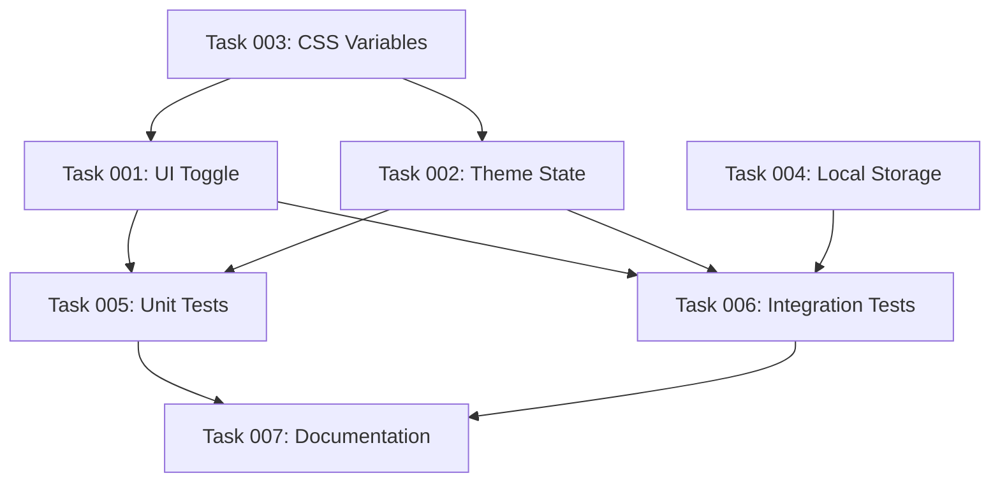

# Beispiel: Filesystem-Struktur für Projektpläne

## Verzeichnis-Struktur

```
.plans/
├── dark-mode-toggle/
│   ├── EPIC.md                              # Haupt-Übersicht des Features
│   ├── STATUS.md                            # Aktuelle Status-Übersicht
│   ├── tasks/
│   │   ├── task-001-ui-toggle-component.md
│   │   ├── task-002-theme-state-management.md
│   │   ├── task-003-css-variables-setup.md
│   │   ├── task-004-local-storage.md
│   │   ├── task-005-unit-tests.md
│   │   ├── task-006-integration-tests.md
│   │   ├── task-007-documentation.md
│   │   └── task-008-code-review.md
│   └── metadata.json                        # Optional: Strukturierte Daten
│
└── user-authentication/
    ├── EPIC.md
    ├── STATUS.md
    ├── tasks/
    │   ├── task-001-jwt-implementation.md
    │   ├── task-002-login-endpoint.md
    │   └── ...
    └── metadata.json
```

## EPIC.md - Beispiel

```markdown
# Dark Mode Toggle

## Status
- **Created**: 2025-01-15
- **Status**: in_progress
- **Priority**: high

## Executive Summary

Implement a dark mode toggle in the application settings to improve user
experience and reduce eye strain during night-time usage. This feature will
allow users to switch between light and dark themes seamlessly.

## Business Value

- Improve user satisfaction (target: +15% in user surveys)
- Increase session duration (target: +10% for night-time users)
- Competitive parity with industry standards

## Success Metrics

| Metric | Baseline | Target | Timeline |
|--------|----------|--------|----------|
| User Satisfaction Score | 7.2/10 | 8.5/10 | Q1 2025 |
| Dark Mode Adoption | 0% | 40% | Q1 2025 |
| Night Session Duration | 12 min | 13.2 min | Q2 2025 |

## Timeline & Milestones

| Milestone | Target Date | Description |
|-----------|-------------|-------------|
| MVP Implementation | 2025-01-31 | Core toggle + basic theming |
| Testing Complete | 2025-02-07 | All tests passing |
| Production Release | 2025-02-14 | Feature live for all users |

## Dependencies

### External Dependencies
- CSS Variables support (already available)
- Browser localStorage (already available)

### Internal Dependencies
- Design system update required
- UI component library v2.0

## Link to PRD

[Full PRD Document](../../docs/prds/dark-mode-toggle.md)
```

## task-001-ui-toggle-component.md - Beispiel

```markdown
# Task-001: UI Toggle Component

## Metadata
- **ID**: task-001
- **Status**: in_progress
- **Priority**: must
- **Estimate**: 3 Story Points
- **Labels**: ui, react, component
- **Assignee**: frontend-developer
- **Created**: 2025-01-15
- **Updated**: 2025-01-16

## Description

Create a reusable toggle component for switching between light and dark modes.
The component should be accessible, follow our design system, and integrate
with the global theme state.

## Acceptance Criteria

- [ ] Toggle component renders correctly in both states
- [ ] Component is keyboard accessible (WCAG 2.1 AA)
- [ ] Animation transitions smoothly (< 200ms)
- [ ] Component integrates with theme context
- [ ] Unit tests achieve > 90% coverage
- [ ] Storybook documentation created

## Dependencies

- **Requires**: None (can start immediately)
- **Blocks**: task-005 (unit tests depend on this implementation)

## Agent Recommendation

**Recommended Agent**: `frontend-developer`

**Rationale**: This task requires React component development expertise,
understanding of accessibility standards, and integration with our design
system. The frontend-developer agent has specialized knowledge in creating
accessible UI components.

## Implementation Notes

### Technical Approach
- Use React hooks for state management
- Implement with `aria-label` and `role="switch"`
- CSS transitions for smooth animation
- Theme toggle icon (sun/moon)

### Design Specifications
- Size: 48x24px
- Border radius: 24px
- Animation: cubic-bezier(0.4, 0, 0.2, 1)
- Colors: From design tokens

### Files to Create/Modify
- `src/components/ThemeToggle/ThemeToggle.tsx`
- `src/components/ThemeToggle/ThemeToggle.test.tsx`
- `src/components/ThemeToggle/ThemeToggle.stories.tsx`
- `src/components/ThemeToggle/styles.css`

## Testing Strategy

### Unit Tests
- Render test (light/dark modes)
- Click interaction test
- Keyboard navigation (Tab, Enter, Space)
- Accessibility audit (jest-axe)

### Integration Tests
- Theme context integration
- Settings page integration

## Notes

Consider adding haptic feedback for mobile devices in a future iteration.
```

## STATUS.md - Beispiel

```markdown
# Project Status: Dark Mode Toggle

**Last Updated**: 2025-01-16 14:30

## Progress Overview

- **Total Tasks**: 8
- **Completed**: 2 (25%)
- **In Progress**: 2 (25%)
- **Pending**: 4 (50%)
- **Blocked**: 0 (0%)

## Tasks by Priority

### Must-Have (MVP)

- [x] task-003: CSS Variables Setup (2 SP) - completed
- [ ] task-001: UI Toggle Component (3 SP) - in_progress
- [ ] task-002: Theme State Management (5 SP) - in_progress
- [ ] task-004: Local Storage Persistence (2 SP) - pending

### Should-Have

- [ ] task-005: Unit Tests (3 SP) - pending
- [ ] task-006: Integration Tests (3 SP) - pending

### Could-Have

- [ ] task-007: Documentation (2 SP) - pending
- [x] task-008: Code Review (1 SP) - completed

## Tasks by Status

### Completed ✅

- **task-003**: CSS Variables Setup (2 SP)
  - Completed: 2025-01-15
  - All CSS variables defined and documented

- **task-008**: Code Review (1 SP)
  - Completed: 2025-01-16
  - Initial codebase review completed

### In Progress 🚧

- **task-001**: UI Toggle Component (3 SP)
  - Started: 2025-01-16
  - Assignee: frontend-developer
  - Progress: Component structure created, working on accessibility

- **task-002**: Theme State Management (5 SP)
  - Started: 2025-01-16
  - Assignee: java-developer
  - Progress: Context API setup complete, working on persistence

### Pending 📋

- **task-004**: Local Storage Persistence (2 SP)
- **task-005**: Unit Tests (3 SP)
- **task-006**: Integration Tests (3 SP)
- **task-007**: Documentation (2 SP)

### Blocked 🚫

None currently.

## Dependencies Graph



## Recent Updates

- **2025-01-16 14:30**: Started work on task-001 (UI Toggle Component)
- **2025-01-16 10:00**: Started work on task-002 (Theme State Management)
- **2025-01-16 09:00**: Completed task-008 (Code Review)
- **2025-01-15 16:00**: Completed task-003 (CSS Variables Setup)

## Next Steps

1. Complete UI Toggle Component (task-001) - ETA: End of day
2. Finish Theme State Management (task-002) - ETA: Tomorrow
3. Begin Local Storage implementation (task-004) - ETA: Tomorrow
```

## metadata.json - Beispiel (Optional)

```json
{
  "feature": {
    "name": "Dark Mode Toggle",
    "id": "dark-mode-toggle",
    "created": "2025-01-15T10:00:00Z",
    "status": "in_progress",
    "priority": "high"
  },
  "prd": {
    "path": "../../docs/prds/dark-mode-toggle.md",
    "version": "1.0"
  },
  "tasks": [
    {
      "id": "task-001",
      "title": "UI Toggle Component",
      "status": "in_progress",
      "priority": "must",
      "estimate": 3,
      "assignee": "frontend-developer",
      "labels": ["ui", "react", "component"],
      "dependencies": {
        "requires": [],
        "blocks": ["task-005"]
      }
    }
  ],
  "metrics": {
    "total": 8,
    "completed": 2,
    "in_progress": 2,
    "pending": 4,
    "blocked": 0
  }
}
```

## Vorteile dieser Struktur

### 1. Versionskontrolle
- Alle Änderungen sind in Git nachverfolgbar
- Diffs zeigen genau, was sich geändert hat
- Branching für experimentelle Pläne möglich

### 2. Flexibilität
- Bearbeitung mit jedem Text-Editor
- Keine Tool-Lock-in
- Markdown für gute Lesbarkeit

### 3. Portabilität
- Keine externe Datenbank benötigt
- Läuft offline
- Einfaches Backup und Sharing

### 4. Integration
- CI/CD kann Tasks parsen
- Scripts können Status automatisch aktualisieren
- Kann in andere Tools importiert werden

### 5. Übersichtlichkeit
- Klare Verzeichnisstruktur
- Konsistente Namenskonventionen
- Hierarchische Organisation
